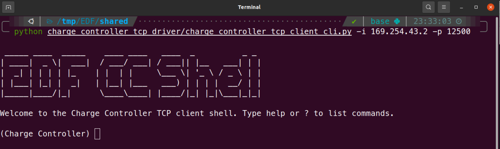

# Charge Controller CLI TCP Client

Command line client for the ChargeController (TCP).

The implemented commands are those of the [command table](../README.md#tableau-de-commandes)  
To get a list of commands, type `help`.  
For more info on a command, type `help <command>`. 

## Screenshot
|                                     |
| ----------------------------------- |
|  |
